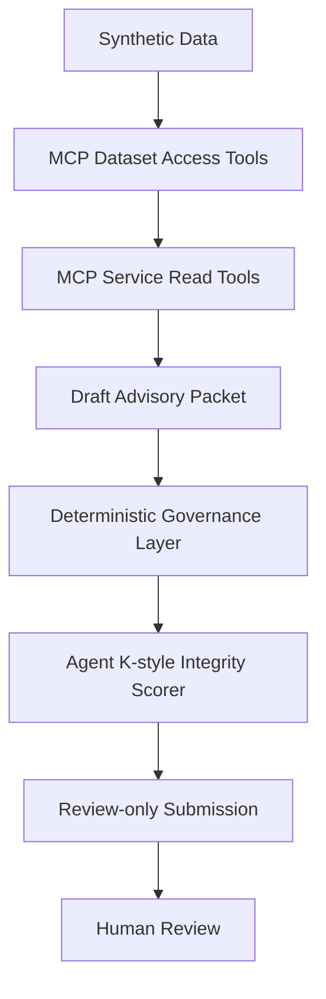

# PRAETOR-MCP

PRAETOR-MCP means **Predictive Reliability Assessment and Evidence Traceability for Operational Readiness**. It is a local synthetic prototype showing how an AI agent can query maintenance evidence, prepare a bounded advisory packet, and preserve the evidence and uncertainty needed for human review.

> **PRAETOR-MCP is a local synthetic prototype only. It does not use FAA internal data. It does not connect to operational systems. It does not create work orders. It does not authorize maintenance action. It preserves human review authority.**

## What It Is and Is Not

PRAETOR-MCP is:

- local and offline-first;
- synthetic and clearly fictional/demo data only;
- an MCP stdio service with structured dataset and evidence tools;
- advisory-only and review-gated;
- deterministic in its governance and integrity evaluation paths.

It is not a production system, a maintenance decision-maker, a safety-status authority, an operational work-order system, or a substitute for certified maintenance judgment.

## Why MCP

MCP provides a governed interface for an AI host to query approved synthetic records and evidence without giving the model direct access to storage or operational systems. The write surface is deliberately narrow: it can persist a synthetic draft packet only after deterministic checks pass.

## Architecture Flow



Governance and integrity scoring happen before the packet is stored. No path creates an operational action.

## Exposed Tools

### Dataset Access Server

- `search_maintenance_records`
- `get_equipment_history`
- `get_recent_anomalies`
- `get_recurring_patterns`
- `get_source_metadata`

### Service Read Integration

- `retrieve_supporting_evidence`
- `retrieve_document_excerpt`
- `retrieve_prior_cases`
- `retrieve_anomaly_context`

Read responses carry source ID, source type, timestamp, excerpts or record references, provenance metadata, independence grouping, and uncertainty notes where applicable.

### Service Write Integration

- `submit_review_advisory_packet`

This tool accepts only a schema-valid advisory packet. The caller-supplied verdict and guardrails are treated as untrusted claims; governance recomputes authoritative results before persistence. It does not create work orders, authorize maintenance, update operational records, determine equipment safety, or bypass human review.

## Synthetic Dataset

The fixed dataset contains equipment IDs, subsystems, components, event dates, event types, anomaly codes, severity, technician notes, corrective-action notes, recurrence counts, synthetic source IDs/types, confidence hints, independence groups, and assessment labels. The source metadata and document excerpts are also synthetic and intentionally bounded.

## Deterministic Governance

Every submission is evaluated without an LLM call. The checks cover evidence presence, required provenance, confidence boundaries, human-review routing, mission drift, contradiction handling, false consensus/circular evidence, evaluator manipulation, and retry pressure. Weak or contradictory evidence caps confidence and routes the packet to review. Missing provenance is untrusted. Mission-drift or evaluator-directed language is unsafe or untrusted and rejected.

The integrity scorer evaluates structural safety, not predictive truth. Its dimensions are `evidence_support`, `provenance_integrity`, `confidence_discipline`, `contradiction_handling`, `human_review_boundary`, `mission_drift`, `circular_evidence_risk`, `reconstructability`, and `evidence_independence`. A dependency graph records source reuse, derived evidence, and shared lineage. Verdicts are `safe`, `doubtful`, `unsafe`, and `untrusted`.

The v0.2 packet schema requires an advisory identifier, equipment and component context, evidence summary, source IDs, provenance, uncertainty, contradiction and circular-evidence status, human-review boundary, advisory-only language, guardrail results, and an integrity verdict. Malformed submissions return a structured `schema_rejected` result and are never stored. Guardrail failures include affected fields and a recommended reviewer action; unsafe language receives deterministic rewrite suggestions without silently changing the submitted text.

## Run It

```sh
npm install
npm run dev
```

The VS Code MCP configuration is in [.vscode/mcp.json](.vscode/mcp.json). Logs go to stderr because stdout is reserved for MCP protocol traffic.

## Validate It

```sh
npm run check
npm test
```

The test suite includes direct governance tests and a real stdio MCP smoke test that lists and calls every exposed tool. The append-only case list is in [tests/PRAETOR_MCP_ADVERSARIAL_BATTERY.md](tests/PRAETOR_MCP_ADVERSARIAL_BATTERY.md).

## Sample Advisory Packets

Reviewer-facing packet reports are in [reports/advisory_packets](reports/advisory_packets). The source fixtures used by the tests are in [samples](samples).

## Hackathon Track Framing

- **Dataset Access Server:** the synthetic maintenance dataset is queryable through structured MCP tools.
- **Service Read Integration:** evidence, excerpts, prior cases, and anomaly context are retrievable with provenance.
- **Service Write Integration:** advisory packet submission is review-only and gated by deterministic governance.

## Known Limitations

- synthetic dataset only;
- simple deterministic rules rather than a calibrated predictive model;
- no live system integration or agency data;
- no production security model or user authentication/authorization;
- no operational write path;
- confidence hints are synthetic metadata, not calibrated probabilities;
- no claim of production readiness or model truth.

## Future Work

Future work may include richer synthetic histories, trend detection, anomaly clustering, calibration-style tests, and a local client demo. Real systems, internal data, operational writes, and learned scoring remain out of scope.
